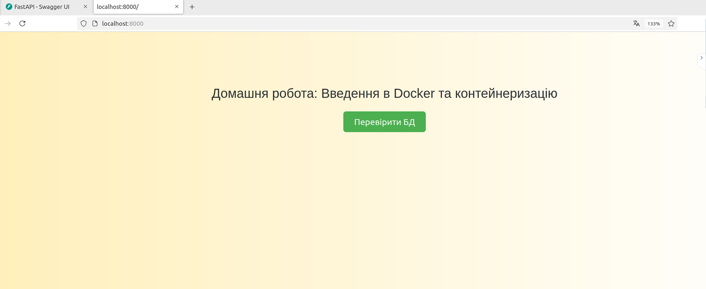
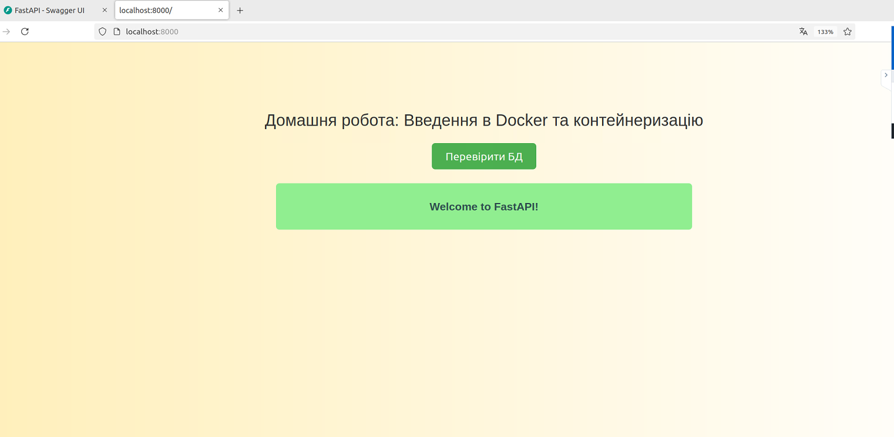
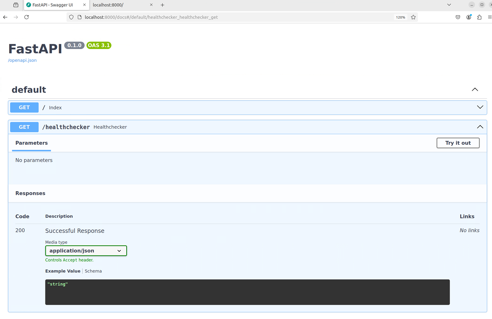

# goit-cs-hw-02

## Завдання 1

Напишіть скрипт, який автоматично перевіряє, чи доступні певні вебсайти. Скрипт повинен використовувати команду curl для надсилання HTTP GET запитів до кожного сайту у списку та перевірки відповіді.

### Покрокова інструкція

1. Список вебсайтів. У вашому скрипті має бути визначений масив з URL вебсайтів, які потрібно перевірити. Наприклад, https://google.com, https://facebook.com, https://twitter.com.

2. Перевірка доступності. Скрипт має перевіряти кожен сайт зі списку за допомогою curl, переконуючись, що сайт відповідає з HTTP статус-кодом 200, що вказує на успішну доступність сайту.

3. Запис результатів у файл. Для кожного сайту результат перевірки (доступний чи недоступний) має бути записаний у файл логів. Назва файлу логів має бути визначена у скрипті.

4. Форматування виходу. Результати мають бути чітко сформульовані, наприклад: "[<https://google.com>](<https://google.com/>) is UP" або "[<https://twitter.com>](<https://twitter.com/>) is DOWN".

5. Вивід інформації. Після виконання скрипту має бути виведено повідомлення, що результати записано у файл логів із його назвою.

**Для запуску скрипту у терміналі:**
```
./task_1.sh
Перевірка доступності сайтів...
https://google.com is UP
https://facebook.com is UP
https://twitter.com is UP
Результати записані у файл: website_status.log
```

## Завдання 2

Клонуйте FastAPI застосунок, налаштуйте і запустіть його в Docker контейнері. Перевірте правильність роботи застосунку та підключення до бази даних.

**Для запуску Докера у терміналі:**
```
sudo docker-compose up --build -d

sudo docker ps
CONTAINER ID   IMAGE                       COMMAND                  CREATED         STATUS         PORTS                                       NAMES
751e97829c8e   computer-systems-hw02_web   "uvicorn main:app --…"   6 seconds ago   Up 6 seconds   0.0.0.0:8000->8000/tcp, :::8000->8000/tcp   fastapi_hw02
d458772de396   postgres:15                 "docker-entrypoint.s…"   7 seconds ago   Up 6 seconds   0.0.0.0:5432->5432/tcp, :::5432->5432/tcp   postgres_hw02

curl http://localhost:8000
<!DOCTYPE html>
<html>
<head>
    <link rel="stylesheet" href="/static/style.css">
</head>
<body>

<div class="main-text">Домашня робота: Введення в Docker та контейнеризацію</div>
<button class="check-button" onclick="checkHealth()">Перевірити БД</button>
<div id="response" class="response"></div>
<script src="/static/main.js"></script>
</body>
</html>oza@oza:~/work/goit/goit-cs-hw-02$ 
```

Вигляд у браузері



